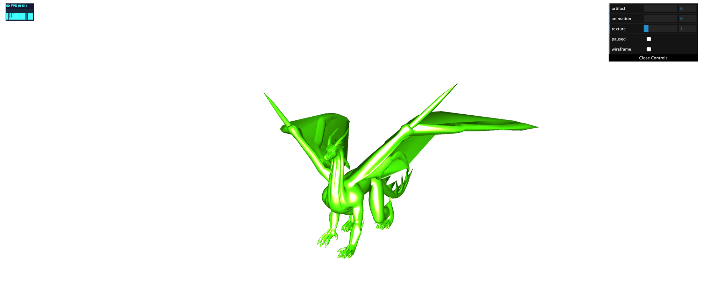
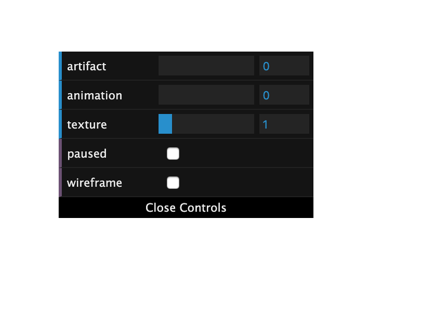
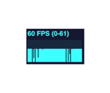

# AnimationEngine
This animation engine will allow you to load fbx files to the web browser.

## Tools used.

1. ThreeJS
2. Jquery

### ThreeJs
This library is used to load fbx file to the web browser, it handles rendering and memory management as well. This library is also asynchronous so be mindful when creating js code using it always use async and await to handle async js.

## Installing Tools 

Before cloning this repo

1. Install NodeJs https://nodejs.org/en/
2. In terminal for mac type, the command npm install nodemon, this will install a custom library you will use to run the project.
3. For Windows install VSCode using https://code.visualstudio.com/, type the command npm Install nodemon in its terminal
4. Type npm install either this will install all the needed dependencies.

## Running the project
1. Type nodemon app to run the application.
2. Visit the directory http://localhost:7000/ to view the full application.
    
## Result 
If you successfully run the project after all the needed components have been installed you will be able to see the following result.

You can control the projects settings using the control panel show below

### Control definitions.

1. **Artifact** changes the animation model 
2. **Animation** controls the action of the model 
3. **texture** controls the color of the model
4. **pause** pauses the animation 
5. **wireframe** shows the structure of the model

You will be able to monitor how much resources the application consumes by looking at the tool below.

